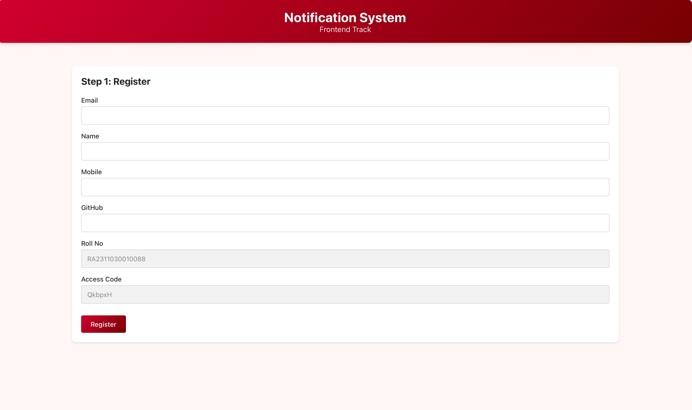

[](https://github.com/krishnarawatsf/logging_middleware/actions)
[](https://github.com/krishnarawatsf/logging_middleware/blob/main/LICENSE)
[](https://github.com/krishnarawatsf/logging_middleware/releases)
[](https://codecov.io/gh/krishnarawatsf/logging_middleware)
[](https://github.com/krishnarawatsf/logging_middleware/network/alerts)


Notification app with React frontend and logging system.

## Folders

```
AFFORDMED/
├── logging middleware/    - Logger package
├── notification_app_fe/   - React app (frontend)
├── notification_app_be/   - Express server (backend)
├── notification_system_design.md
└── .gitignore
```

## How to Run

### Frontend

```bash
cd notification_app_fe
npm install
npm run dev
```

App opens at http://localhost:5173

**Steps:**
1. Fill form (email, name, mobile, GitHub username)
2. Roll number: 
3. Access code: 
4. Click Register → save ClientID and ClientSecret
5. Click Authenticate
6. Create notification

## Frontend Interface



### Backend (Optional)

```bash
cd notification_app_be
npm install
npm run dev
```

Server at http://localhost:3000

## API Endpoints

**Register** - POST http://20.207.122.201/evaluation-service/register

**Auth** - POST http://20.207.122.201/evaluation-service/auth

**Logs** - POST http://20.107.122.201/evaluation-service/logs

## Logger

Logger is in `logging middleware/logger.ts`

Log levels: debug, info, warn, error, fatal

Packages: api, component, auth, config, middleware, utils, etc.

## Important
 Registration is ONE-TIME ONLY

Save ClientID and ClientSecret immediately. Cannot get again.

Roll No: RA2311030010088
Access Code: QkbpxH

## Contributing
Thanks for checking out this project — to contribute, open an issue describing the change, then submit a PR with tests where applicable. See `CONTRIBUTING.md` for more.
